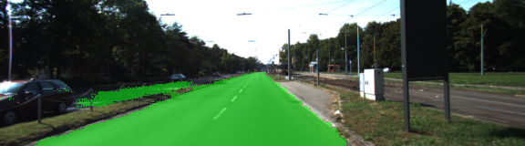

README
===
(I used  batch_size 1 to do the training because of the memory issue of my machine. People suggests batch_size 1 on forum to avoid inefficient memory issue. I use epoch 20 because the totally training time caused about 7-8 hours on my laptop.)

1. The steps and loss output during training:
----
step: 100, loss:0.92
step: 200, loss:0.72
step: 300, loss:0.65
step: 400, loss:0.56
step: 500, loss:0.47
step: 600, loss:0.38
step: 700, loss:0.30
step: 800, loss:0.25
step: 900, loss:0.24
step: 1000, loss:0.17
step: 1100, loss:0.16
step: 1200, loss:0.17
step: 1300, loss:0.16
step: 1400, loss:0.08
step: 1500, loss:0.11
step: 1600, loss:0.19
step: 1700, loss:0.07
step: 1800, loss:0.25
step: 1900, loss:0.11
step: 2000, loss:0.08
step: 2100, loss:0.08
step: 2200, loss:0.08
step: 2300, loss:0.13
step: 2400, loss:0.14
step: 2500, loss:0.14
step: 2600, loss:0.08
step: 2700, loss:0.09
step: 2800, loss:0.08
step: 2900, loss:0.05
step: 3000, loss:0.05
step: 3100, loss:0.06
step: 3200, loss:0.07
step: 3300, loss:0.10
step: 3400, loss:0.05
step: 3500, loss:0.05
step: 3600, loss:0.04
step: 3700, loss:0.02
step: 3800, loss:0.05
step: 3900, loss:0.03
step: 4000, loss:0.07
step: 4100, loss:0.07
step: 4200, loss:0.09
step: 4300, loss:0.14
step: 4400, loss:0.10
step: 4500, loss:0.05
step: 4600, loss:0.03
step: 4700, loss:0.04
step: 4800, loss:0.05
step: 4900, loss:0.03
step: 5000, loss:0.06
step: 5100, loss:0.02
step: 5200, loss:0.13
step: 5300, loss:0.04
step: 5400, loss:0.05
step: 5500, loss:0.05
step: 5600, loss:0.05
step: 5700, loss:0.04

2. Result Examples 
---

