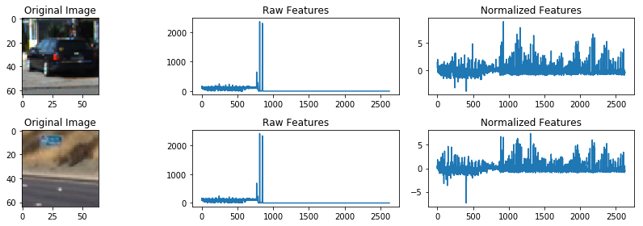
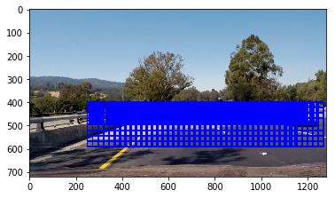
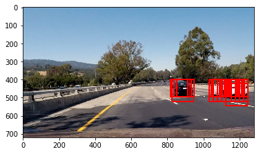
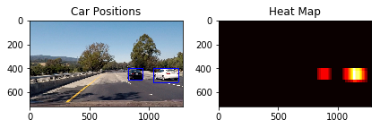

## Report ##
---
(Please find the jupyter notebook about codes and image results)

###1. Classification
-----

I started by implementing the classifier and the algorithm to extract features. The code block 2 has the code of the feature extraction algorithm of the color features. Code block 3 has the code of the feature extraction of HOG. 

For color features, two set of features are extracted. First is the spatial binning, which is to unroll the pixels and uses the flat array of pixel values as the feature vector. The second is the color histogram. Based on one of the color conversions (RGB, HSV, LUV, etc.), the histograms of each color channel are collected. This algorithm basically profile the distribution of color values of each channel. 

HOG is implemented by using the hog function from the Scikit library. The hog function collect the histograms of the direction of the gradients. 

Then I append all the features together as the full feature set of each figure. The features in the feature set need to be normalized. StandardScaler() and fit() are used to created the scaler and normalized all the features. In code block 6, I plot two figures from the car and not car figure sets and show the pre and after normalization features set.




Code block 7 shows the training process using LinearSVC(). The feature vector is of 2628 size and the accuracy of SVC is 0.98.

For the feature parameters, I tried several different color spaces like RGB, LUV, and YCrCb. For HOG, I uses the parameters from the lecture. I tried to play with the parameters and found the training time could vary a lot. If I uses 6000 features, the training time could be up to 50 seconds. When I use 2000 features, the training time is under 10 seconds. For accuracy, I did not find significant difference by using different color spaces by using more than 2000 features.

Below is the list of the HOG paramers I used:

| params   |      value   |
|----------|:-------------:|
| orient |  9 | 
| pix_per_cell |    8   |
| cell_per_block  | 2 | 
| color space | 'LUV' |
 | channel | 0  |

I use the parameters above to complete the project. The orient, pix_per_cell, and cell_per_block are the same parameters coming from the lecture. After I finished the project, I did some additional explarations with various paramters. The test is based on the microbenchmark (code block from "29 hot classify" class):


| orient |  pix_per_cell | cell_per_block | channel | feature count | accuracy|
|----------|:-------------:|---------|:-------------:|:-------------:|
| 12 |  8     |  2|  0  | 2352  | 0.95 |
| 12 | 10     |  2|  0  | 1200  | 0.97 |
| 12 | 16     |  2|  0  | 432  | 0.925 |
| 9 | 12   |  2|  0  | 576  | 0.94 |
|12| 12   |  2|  0  | 768 | 0.955 |
| 12 | 10     |  2|  ALL  | 3600  | 0.995 |
| 12 | 10     |  2|  1  | 1200  | 0.975 |
 12 | 10     |  2|  2  | 1200  | 0.95 |
 
 
 From the table, we can see that by using all channels, the accuracy is the highest which is up to 0.995. Using channel 0 and channel 2 gives similar results but channel 1 gives higher accuracy. For the other parameters, I found the oirent 12  and pix_per_cell 10 gives the higher accuracy. This is interesting since when I use pix_per_cell 8, the feature count is 2352, which is larger than using 10 as pix_per_cell, but the accuracy is lower. This is likely because of when I use smaller number of pix_per_cell, more noises are introduced. Larger number of pix_per_cell can reduce some of the noise factor. Another conlusion is that although using all channels could improve the accuracy, it also increases the feature count by 3x. For speed consideration, using channel 1 or 2 may be more effective in real use case.
 
###2. Sliding window searching
---
From code block 8, I start to implement the sliding window searching algorithms. I created a function to use various scaled windows on the figure. The window size are:
80x80, 96x96, and 120x120. 
The ranges for each window size are:
x:300-1250 y:400-464
x:250-1250 y:400-500
x:250-1280 y:400-600
Overlapping amounts are:
0.5x0.5, 0.9x0.9, 0.8x0.8

All the parameters are determined by trying on the test car images. After code block 8, I showed a figure with all the windows plotted on it. 




In code block 9, I read in an image, and then loop around all the windows. For each window, I extracted features and use the SVC classifier to classify the slice of the image. After code block 9, I showed an example image with the cars located by multiple windows.



Then following the lecture, I implemented the heat map algorithm to reject false positives. Basically, when multiple windows match a car, the area will become more "heated". So the area is more likely to be a car. If only one window matches, it will be filtered out. Please checkout code block 9 to find the implementation details. I show the heat map example from the output of code block 9.


###3. Image Processing Pipeline.
----
The pipeline includes fl_image to read in images from the video. Then search_windows() to iterate all the sliding windows and classify each slice of the image. Then apply the heat map to locate windows that have multiple matches. Then draw boxes around the car.

Please find the final output videos from final_output.mp4


###4. Stabilization and False positive rejection.
----
Besides using the heat map to reject false positive, I uses another history based algorithm to reject false positives. The similar algorithm I also used for stabilize the windows. I found the window boxes could shake a lot while recognizing.

The algorithm could be found in code block 10:

```
history_length = 10
history_list = []
def check_falsepos(box):
    center_x = (box[0][0]+box[1][0])/2
    center_y = (box[0][1]+box[1][1])/2
    find_cnt = 0
    for i in range(0, len(history_list)):
        for j in range (0, len(history_list[i])):
            tmp_cent_x = (history_list[i][j][0][0]+history_list[i][j][1][0])/2
            tmp_cent_y = (history_list[i][j][0][1]+history_list[i][j][1][1])/2
            if  (tmp_cent_x - 50 < center_x < tmp_cent_x + 50)  and \
                (tmp_cent_y - 50 < center_y < tmp_cent_y + 50):
                    find_cnt += 1
    if find_cnt > 5:
        return 1
    else:
    	return 0
```

Basically I created a limited sized array to record the window boxes in previous frames. If the newly recognized box's location is too much different from previous frames' recognized boxes, I will reject this box. The algorithm based on the previous frames' boxes' averaged center locations. If the new box is far from the previous boxes' center, it is likely to be a false positive.

I also applied this algorithm to stabilize the window box. I use a weighted average to recenter the newly recognized box, so that the box shape will not change too drastically from frame to frame. The final output video shows that the algorithm works pretty well.

###5. Discussions
----

I feel the python based algorithm is too slow for real time recognition. The sliding window is not very efficient since all the windows need to be iterated. I think in real time recognition, windows that around a previous recognized car should be searched, and the edge of the camera should be searched since new car could appear. Other places can be optimized out in real time recognition.

Another interesting topic is to use neural network to do classification. I fell NN is the best way to do image classification comparing to SVM or decision tree. But it depends on both accuracy and speed.

Calculate the distance from the car box is also not very clear to me. How to calculate the distance between the car in front and my car? This is critical to avoid accident.
